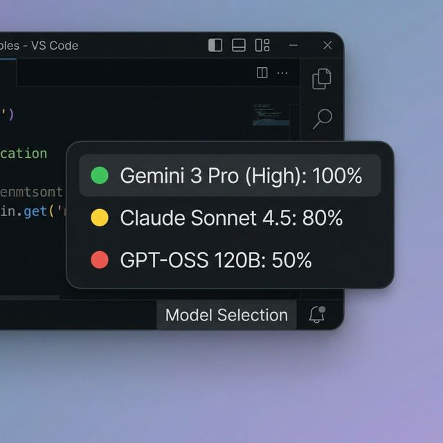

# Antigravity Quota Monitor

Status bar extension for Antigravity that shows model quota usage.




## Features

- Updates every 5 seconds to show remaining limits.
- Automatically tracks whichever model you have active in Antigravity.
- Color coding for easy status checks:
    - Green: 100% quota.
    - Yellow: 50% - 99% quota.
    - Red: Below 50% quota.
- Hover the status bar item to see a list of all models and their usage.
- Click the rocket to manually pick a model (it will snap back to the active model on the next refresh).

## Installation (Mac)

1. Download Antigravity-Quota-Monitor.zip from this repo.
2. Unzip the folder.
3. Open Terminal in the unzipped folder and run:
   ```bash
   chmod +x install.sh
   ./install.sh
   ```
4. Restart Antigravity.

## How it works

The extension queries the local Antigravity Language Server. It finds the port and CSRF token from the running process, so there's no manual setup or API keys needed.

## Development

1. git clone https://github.com/caamer20/Antigravity-Quota-Monitor.git
2. npm install
3. npm run compile
4. Run install.sh to test your changes.
